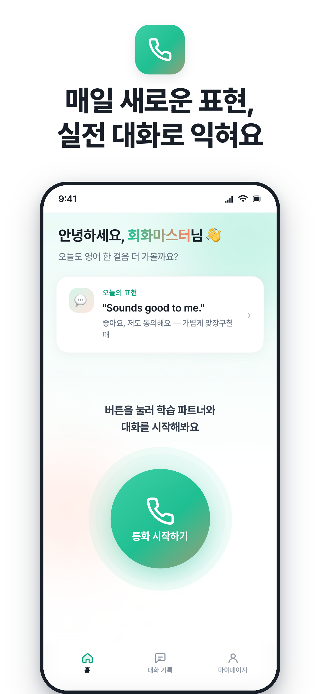
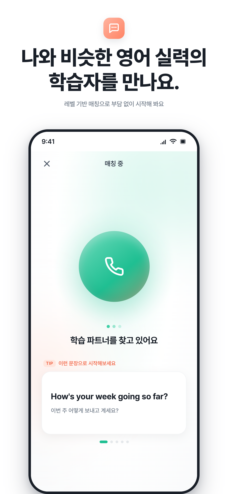
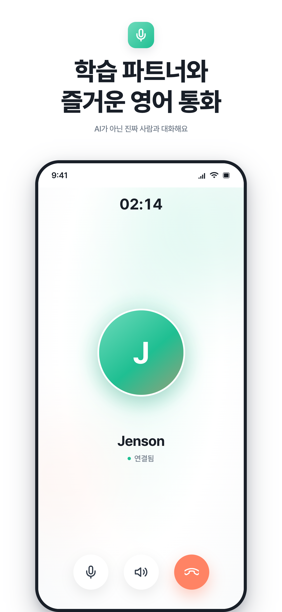
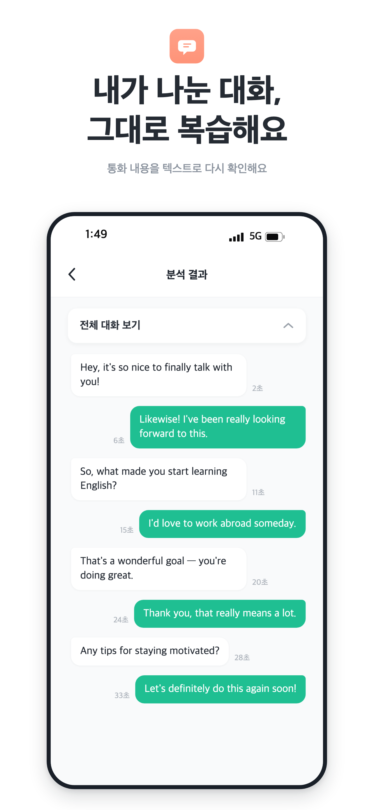
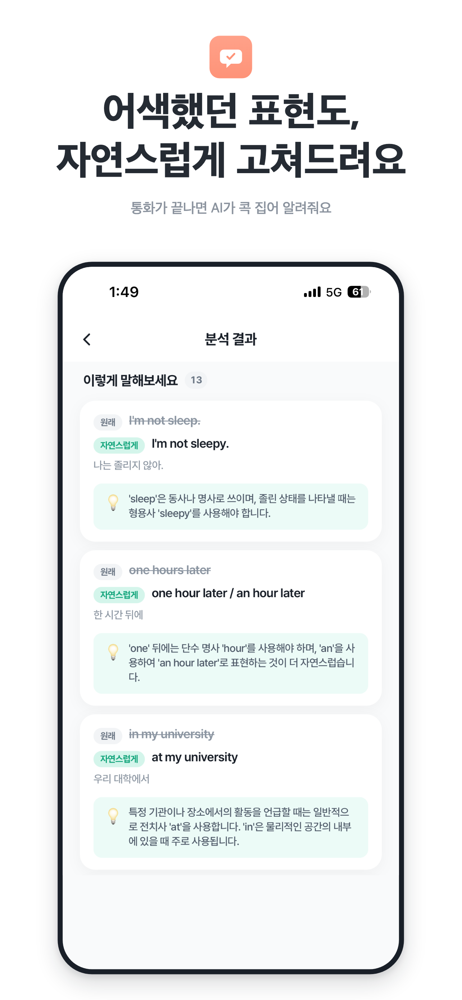

# LingRing

### 어색한 영어 회화, 가볍게 시작해요

랜덤 매칭으로 대화하고, AI 피드백으로 바로 복습해요

#### 🌐 **랜딩 페이지** &nbsp;[바로가기](https://landing.lingring.site/) &nbsp;&nbsp;&nbsp;&nbsp;&nbsp;&nbsp; 📲 **App Store** &nbsp;[바로가기](https://apps.apple.com/kr/app/id6766043927)

 

 

## 🔗 LingRing
**LingRing**은 비슷한 실력의 사람과 영어로 대화하며 배우는 회화 학습 플랫폼입니다.

혼자 하는 공부는 지루하고, 원어민과의 대화는 부담스럽죠. LingRing은 그 사이에서 시작해요.
통화가 끝나면 **AI가 내 표현을 자연스럽게 다듬어** 바로 복습할 수 있어요.

 

## ✨ 주요 기능

### 🎯 매칭 — 버튼 하나로 실전 영어 대화

홈에서 통화 버튼을 누르면 나와 비슷한 레벨의 학습자와 매칭돼요. 상대가 연결되면 AI가 아닌 **실제 사람**과 바로 음성 대화가 시작돼요.

<table>
  <tr>
    <td align="center" width="33%">
      
    </td>
    <td align="center" width="33%">
      
    </td>
    <td align="center" width="33%">
      
    </td>
  </tr>
  <tr>
    <td align="center"><b>메인 화면</b></td>
    <td align="center"><b>매칭 중</b></td>
    <td align="center"><b>매칭 후 통화</b></td>
  </tr>
</table>

 

### 💡 피드백 — 대화를 그대로 복습하고, AI가 다듬어줘요

통화가 끝나면 대화 내용을 텍스트로 다시 확인하고, AI가 어색했던 표현을 자연스럽게 고쳐 그 이유까지 알려줘요.

<table>
  <tr>
    <td align="center" width="50%">
      
    </td>
    <td align="center" width="50%">
      
    </td>
  </tr>
  <tr>
    <td align="center"><b>대화 기록 확인</b></td>
    <td align="center"><b>AI 표현 피드백</b></td>
  </tr>
</table>

 

